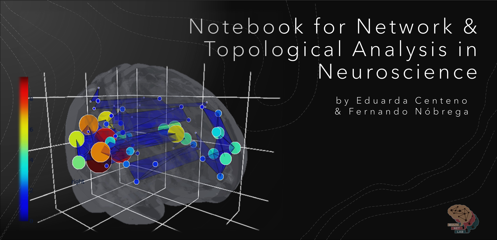
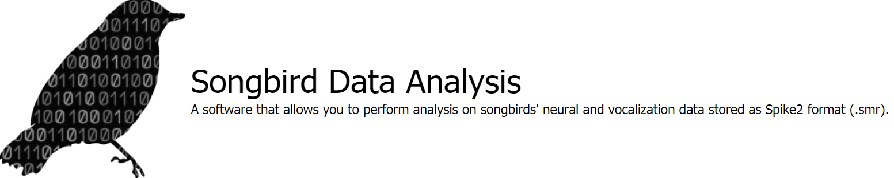

## # About me

```
Contact information: e.centeno@amsterdamumc.nl
Twitter: @eduardagzc
LinkedIn: https://www.linkedin.com/in/eduardagzc/
```

#### B.Sc in Biotechnology, M.S.c in Neuroscience (Neuramus Programme - Université de Bordeaux & Vrije Universiteit Amsterdam) with +6 years of experience in research in different areas such as electrophysiology, cell culture, molecular biology, cell biology, animal models, brain dissection. I now focus on computational neuroscience and open science. 

#### I currently work as a part-time Research Assistant at the Vrije Universiteit Medical Center (VUmc Amsterdam - Netherlands), and I'm also a PhD student in Neuroscience at the Université de Bordeaux (Bordeaux Neurocampus - France). As an RA, I work mainly with implementing Open Science tools (including GitHub) to improve the accessibility, findability, and reuse of the [MULTINET LAB](https://github.com/multinetlab-amsterdam) scripts, pipelines, and eventually data. As a PhD student, I investigate the underlying neural mechanisms of song production in songbirds (zebra finches), trying to uncover the potential role of high-frequency oscillations in the song system circuitry. A major part of my project is to develop/contribute to/work with open-source Python tools (e.g., [neo](https://github.com/NeuralEnsemble/python-neo), [elephant](https://github.com/NeuralEnsemble/elephant), [odmltables](https://github.com/INM-6/python-odmltables)). The [E4-IMN team](https://github.com/IMN-E4) is also migrating to GitHub, where we'll make available our data analysis pipelines.

##### My interests: [#open-science](https://twitter.com/hashtag/openscience?ref_src=twsrc%5Egoogle%7Ctwcamp%5Eserp%7Ctwgr%5Ehashtag) [#neuroscience](https://twitter.com/search?q=%23Neuroscience&src=typed_query) [#python](https://twitter.com/search?q=%23python&src=typed_query)


-------------------------------------------------------------------------
## # GitHub projects

1. [Notebook for Network and Topological Analysis in Neuroscience](https://github.com/multinetlab-amsterdam/network_TDA_tutorial)
<p align="center">
 
</p>

2. [Songbird neural data analysis](https://aleblois.github.io/SongbirdNeuralDataAnalysis/)
<p align="center">
 
</p>

<!--
**eduardacenteno/eduardacenteno** is a ✨ _special_ ✨ repository because its `README.md` (this file) appears on your GitHub profile.
